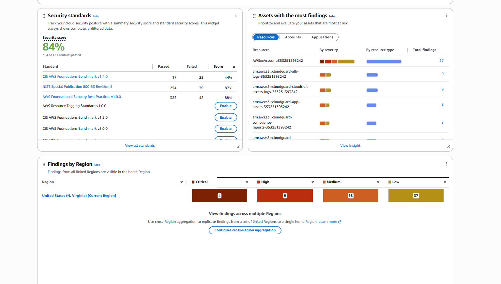
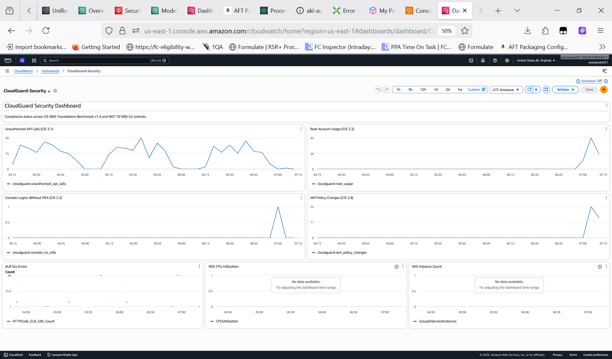
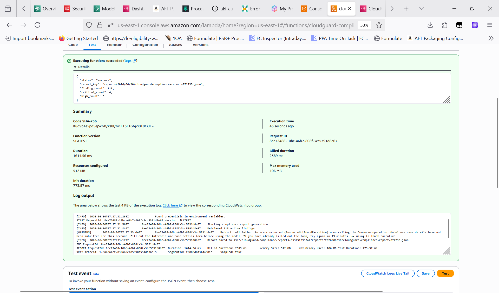

<div align="center">

# CloudGuard

### Automated Compliance Landing Zone on AWS

*A production-grade, Infrastructure-as-Code reference implementation of a secure, continuously monitored AWS environment mapped to the CIS AWS Foundations Benchmark v1.4 and NIST SP 800-53 Rev 5.*

[](https://www.terraform.io/)
[](https://aws.amazon.com/)
[](https://www.python.org/)
[](LICENSE)
[](docs/compliance_matrix.md)
[](docs/compliance_matrix.md)

</div>

---

## Live Results

> Deployed and validated in a real AWS account — June 2026.

### Security Hub — 84% Compliance Score


*354 of 421 controls passing across CIS v1.4, NIST SP 800-53 Rev 5, and AWS FSBP v1.0.0.*

### CloudWatch Security Dashboard


*Live telemetry: unauthorized API calls, root account usage, MFA compliance, IAM changes, ALB errors, RDS CPU, and ASG instance count — all sourced from real CloudTrail activity.*

### Lambda Compliance Report — Succeeded


*118 active findings pulled from Security Hub (4 critical, 9 high). Report saved to S3 as JSON. Runs daily on a cron schedule.*

---

## Overview

CloudGuard is a fully automated AWS security and compliance environment deployed via Terraform. It provisions a 3-tier web architecture protected by continuous compliance monitoring, auto-remediation, and AI-generated compliance reporting.

**The problem it solves:** Most teams achieve compliance once during an audit and drift immediately after. CloudGuard makes compliance continuous — every resource change is evaluated against CIS and NIST controls in real time, violations trigger automatic remediation within two minutes, and a daily AI-generated executive report summarizes the posture.

**Who this is for:**
- Teams migrating regulated workloads to AWS (HIPAA, PCI DSS, FedRAMP)
- Engineers implementing the AWS Shared Responsibility Model
- Organizations seeking to automate GRC (Governance, Risk, Compliance) on AWS

---

## Architecture

```
                            ┌──────────────────────────────────────────┐
                            │              AWS Account                  │
  Internet                  │                                           │
     │                      │  ┌─────────── Public Subnets ──────────┐  │
     │  HTTPS/HTTP           │  │  ┌──────────────────────────────┐   │  │
     └──────────────────────►│  │  │   Application Load Balancer  │   │  │
                            │  │  │   (HTTPS:443 / HTTP:80)       │   │  │
                            │  │  └───────────────┬──────────────┘   │  │
                            │  └─────────────────┼────────────────────┘  │
                            │                    │ :8080                  │
                            │  ┌─────────── Private Subnets ──────────┐  │
                            │  │  ┌──────────────────────────────┐   │  │
                            │  │  │  EC2 Auto Scaling Group       │   │  │
                            │  │  │  (AL2023, IMDSv2, EBS KMS)   │   │  │
                            │  │  └───────────────┬──────────────┘   │  │
                            │  │                  │ NAT GW (outbound) │  │
                            │  └─────────────────┼────────────────────┘  │
                            │                    │ :5432                  │
                            │  ┌─────────── Isolated Subnets ─────────┐  │
                            │  │  ┌──────────────────────────────┐   │  │
                            │  │  │  RDS PostgreSQL 15            │   │  │
                            │  │  │  (no internet route, KMS)    │   │  │
                            │  │  └──────────────────────────────┘   │  │
                            │  └──────────────────────────────────────┘  │
                            │                                            │
                            │  ┌─────────── Security Layer ───────────┐  │
                            │  │                                       │  │
                            │  │  CloudTrail ──► S3 (KMS)             │  │
                            │  │      │                                │  │
                            │  │      └──► CloudWatch Logs             │  │
                            │  │              │                        │  │
                            │  │              ├── 14x CIS 3.x Metric   │  │
                            │  │              │   Filters + Alarms     │  │
                            │  │              │                        │  │
                            │  │  AWS Config ──► 23 Managed Rules      │  │
                            │  │      │                                │  │
                            │  │      └──► EventBridge                 │  │
                            │  │              │                        │  │
                            │  │    ┌─────────┴──────────┐            │  │
                            │  │    │  Lambda Functions  │            │  │
                            │  │    │  ┌──────────────┐  │            │  │
                            │  │    │  │ remediate_s3 │  │            │  │
                            │  │    │  │ remediate_sg │  │            │  │
                            │  │    │  │ report (AI)  │  │            │  │
                            │  │    │  └──────────────┘  │            │  │
                            │  │    └────────────────────┘            │  │
                            │  │                                       │  │
                            │  │  Security Hub (CIS v1.4 + FSBP)      │  │
                            │  │  GuardDuty (malware + threat intel)   │  │
                            │  │  SNS ──► Email Alerts                 │  │
                            │  └───────────────────────────────────────┘  │
                            └──────────────────────────────────────────┘
```

**3 Availability Zones | 9 Subnets (3 per tier) | No single point of failure**

---

## Key Features

### Security Architecture
- **Zero SSH** — SSM Session Manager replaces all SSH access; port 22 is never opened anywhere
- **IMDSv2 enforced** — blocks SSRF-based EC2 metadata credential theft
- **Default SG deny-all** — default security group in the VPC has no rules (CIS 5.4)
- **5 separate KMS CMKs** — one per service (S3, RDS, EBS, CloudWatch, Secrets Manager), all with annual rotation
- **Private RDS** — database sits in an isolated subnet with no outbound internet route; unreachable from outside VPC
- **VPC Endpoints** — SSM and S3 traffic stays inside the AWS network backbone

### Continuous Compliance Monitoring
- **23 AWS Config managed rules** covering CIS v1.4 Sections 1, 2, 3, 5 and NIST SP 800-53
- **14 CloudWatch metric filters** implementing every CIS Section 3 logging control
- **Security Hub** aggregates findings from Config, GuardDuty, and Inspector into a normalized view
- **CIS AWS Foundations Benchmark v1.4**, **NIST SP 800-53 Rev 5**, and **AWS FSBP v1.0** enabled as Security Hub standards

### Auto-Remediation (< 2 min time-to-fix)
| Violation | Trigger | Action |
|---|---|---|
| S3 bucket public read | `s3-bucket-public-read-prohibited` | Blocks all 4 public access settings via API |
| S3 bucket public write | `s3-bucket-public-write-prohibited` | Blocks all 4 public access settings via API |
| Unrestricted SSH (port 22) | `restricted-ssh` | Revokes 0.0.0.0/0 ingress rule from SG |
| Unrestricted RDP (port 3389) | `restricted-common-ports` | Revokes 0.0.0.0/0 ingress rule from SG |

### AI-Generated Compliance Reports
A daily Lambda queries Security Hub findings, calls **Amazon Bedrock (Claude 3 Haiku)**, and generates a human-readable executive compliance narrative saved to S3. Reports include severity breakdowns, top risks, and recommended remediations — formatted for CISO review.

---

## AWS Services

| Service | Tier | Purpose |
|---|---|---|
| VPC + Subnets + Route Tables | Networking | 3-tier network isolation |
| ALB | Compute | HTTPS-terminated load balancing, access logs |
| EC2 Auto Scaling Group | Compute | Stateless app tier across 3 AZs |
| RDS PostgreSQL 15 | Database | Encrypted, private, automated backups |
| AWS KMS | Security | 5 CMKs — encryption at rest for all data stores |
| AWS IAM | Security | Least-privilege roles per component |
| AWS CloudTrail | Audit | Multi-region, log file validation, KMS encrypted |
| AWS Config | Compliance | 23 managed rules, continuous resource evaluation |
| AWS Security Hub | Compliance | Aggregated findings, CIS v1.4 + NIST 800-53 + FSBP standards |
| Amazon GuardDuty | Threat Detection | ML-based threat detection, malware scanning |
| Amazon CloudWatch | Monitoring | 14 metric filters, alarms, security dashboard |
| AWS Lambda (Python 3.12) | Automation | Auto-remediation + AI compliance reports |
| Amazon EventBridge | Orchestration | Event-driven Lambda triggers from Config/GuardDuty |
| Amazon SNS | Alerting | Email notifications for HIGH/CRITICAL findings |
| Amazon Bedrock (Claude 3) | AI | Daily compliance report narrative generation |
| AWS Secrets Manager | Credentials | DB credentials encrypted with CMK |
| VPC Endpoints (SSM, S3) | Networking | AWS API calls stay off the public internet |

---

## Compliance Coverage

Full control-to-resource mapping: [`docs/compliance_matrix.md`](docs/compliance_matrix.md)

### CIS AWS Foundations Benchmark v1.4

| Section | Controls | Coverage |
|---|---|---|
| 1 — Identity and Access Management | 1.4, 1.5, 1.8–1.11, 1.10, 1.14, 1.16 | 9 controls monitored |
| 2 — Storage | 2.1.1, 2.1.2, 2.1.5, 2.2, 2.3, 2.4, 2.6, 2.7, 2.8, 2.9 | 10 controls enforced or monitored |
| 3 — Logging | 3.1–3.14 | **All 14 controls implemented** |
| 5 — Networking | 5.2, 5.3, 5.4 | 3 controls (2 with auto-remediation) |

### NIST SP 800-53 Rev 5 Families Covered

`AC` Access Control · `AU` Audit and Accountability · `CA` Assessment and Authorization · `CM` Configuration Management · `IA` Identification and Authentication · `IR` Incident Response · `SC` System and Communications Protection · `SI` System and Information Integrity

---

## Quick Start

### Prerequisites

| Tool | Version | Install |
|---|---|---|
| Terraform | >= 1.6 | [terraform.io/downloads](https://developer.hashicorp.com/terraform/downloads) |
| AWS CLI | >= 2.x | [aws.amazon.com/cli](https://aws.amazon.com/cli/) |
| Python | 3.12+ | [python.org](https://www.python.org/) |
| AWS Account | — | Free tier works for dev |

### 1. Configure AWS credentials

```bash
aws configure
# AWS Access Key ID: <your key>
# AWS Secret Access Key: <your secret>
# Default region: us-east-1
# Default output: json
```

### 2. Clone and configure

```bash
git clone https://github.com/youngryan521/CloudGuard.git
cd CloudGuard/terraform
```

Create `terraform.tfvars` (never commit this file — it's in `.gitignore`):

```hcl
aws_region  = "us-east-1"
environment = "dev"
alert_email = "your@email.com"

db_username = "cgadmin"
db_password = "YourSecurePassword123!"  # Min 8 chars, no @ / " or spaces
```

### 3. Deploy

```bash
terraform init
terraform plan   # Review ~85 resources before applying
terraform apply  # Takes ~12 minutes (RDS is the slow part)
```

### 4. Enable Security Services

After apply, manually enable these two services in the AWS Console (required once per account):

1. **GuardDuty** → Console → GuardDuty → Get Started → Enable GuardDuty
2. **Security Hub** → Console → Security Hub → Go to Security Hub → Enable
   - Select: AWS Foundational Security Best Practices, CIS v1.4, NIST SP 800-53 Rev 5

Security Hub begins populating compliance scores within 30–60 minutes.

### 5. Verify

After apply completes, Terraform outputs:

```
alb_dns_name              = "cloudguard-alb-xxxx.us-east-1.elb.amazonaws.com"
cloudwatch_dashboard_url  = "https://us-east-1.console.aws.amazon.com/cloudwatch/..."
security_hub_url          = "https://us-east-1.console.aws.amazon.com/securityhub/..."
```

### 6. Tear down

```bash
terraform destroy
```

> **Cost note:** Running this stack 24/7 in dev costs ~$3–5/day (NAT Gateway + RDS + EC2 t3.micro). Tear down when not in use. The security services (Config, Security Hub, GuardDuty) have free tiers but will incur small charges for high-volume accounts.

---

## Project Structure

```
CloudGuard/
├── terraform/
│   ├── main.tf                 # Provider, backend, shared data sources
│   ├── variables.tf            # All input variables with descriptions
│   ├── outputs.tf              # Dashboard URLs, endpoints, bucket names
│   ├── vpc.tf                  # VPC, subnets, IGW, NAT, route tables, flow logs
│   ├── security_groups.tf      # 4 SGs (ALB/App/RDS/Lambda) + VPC Endpoints
│   ├── kms.tf                  # 5 CMKs with key policies and rotation
│   ├── iam.tf                  # Roles, policies, instance profiles, password policy
│   ├── compute.tf              # ALB, Target Group, Launch Template, ASG
│   ├── database.tf             # RDS PostgreSQL, Secrets Manager, enhanced monitoring
│   ├── cloudtrail.tf           # Multi-region trail, S3 bucket, CloudWatch integration
│   ├── config.tf               # Config recorder + 23 managed rules
│   ├── securityhub.tf          # EventBridge rule for GuardDuty HIGH/CRITICAL findings
│   ├── monitoring.tf           # 14 CIS metric filters, alarms, CloudWatch dashboard
│   └── lambda.tf               # Lambda functions, EventBridge rules, reports bucket
│
├── lambda/
│   ├── remediate_s3.py         # Blocks S3 public access; updates Security Hub finding
│   ├── remediate_sg.py         # Revokes unrestricted SSH/RDP ingress; SNS notification
│   └── compliance_report.py    # Queries Security Hub, calls Bedrock, saves JSON report
│
└── docs/
    ├── compliance_matrix.md    # Full CIS v1.4 + NIST SP 800-53 Rev 5 control mapping
    └── screenshots/            # Live deployment evidence
```

---

## AWS Well-Architected Framework

CloudGuard is designed against all five pillars of the [AWS Well-Architected Framework](https://aws.amazon.com/architecture/well-architected/).

### Operational Excellence
- All infrastructure defined in Terraform — no manual console changes
- CloudWatch dashboard provides single-pane visibility into security posture
- EventBridge-driven auto-remediation eliminates manual toil for common violations
- Terraform outputs provide direct console deep links post-deployment

### Security
- **Identity:** Least-privilege IAM roles per component; no wildcard policies; no root access keys; MFA enforced via Config
- **Detection:** CloudTrail + GuardDuty + Security Hub provide layered detection across all API activity, network traffic, and resource configuration
- **Infrastructure:** 3-tier VPC isolation; default SG deny-all; IMDSv2; no SSH key pairs
- **Data:** Encryption at rest (KMS CMK) for every data store; encryption in transit (HTTPS/TLS) at ALB; credentials in Secrets Manager

### Reliability
- Auto Scaling Group spans 3 Availability Zones — tolerates 1 full AZ failure
- RDS automated backups with 7-day retention
- ALB health checks and instance refresh for zero-downtime deployments
- VPC Endpoints prevent outage from S3/SSM internet connectivity issues

### Performance Efficiency
- AL2023 AMI sourced from SSM Parameter Store — always latest, no hardcoded AMI IDs
- RDS storage auto-scaling (20 GB → 100 GB automatic)
- gp3 volumes for both EC2 and RDS — better baseline performance than gp2 at same cost
- CloudWatch detailed monitoring (1-minute granularity) on all instances

### Cost Optimization
- t3.micro EC2 and db.t3.micro RDS — Free Tier eligible for dev
- Single NAT Gateway in dev (variable to 3 for prod HA)
- S3 bucket key enabled on all KMS configurations — reduces KMS API costs by ~99%
- Lambda auto-remediation prevents costly breach scenarios (shift-left security)

---

## Customization

Key variables in `variables.tf` to adjust for your environment:

| Variable | Default | Notes |
|---|---|---|
| `aws_region` | `us-east-1` | Any AWS region |
| `environment` | `dev` | Tags all resources |
| `app_instance_type` | `t3.micro` | Scale up for prod |
| `db_instance_class` | `db.t3.micro` | Scale up for prod |
| `db_multi_az` | `false` | Set `true` for prod HA |
| `asg_min/max/desired` | `1/3/1` | Adjust for load |
| `access_key_max_age_days` | `90` | CIS 1.14 threshold |
| `compliance_report_schedule` | `cron(0 8 * * ? *)` | Daily 8am UTC |
| `alert_email` | `""` | Set to receive SNS alerts |

---

## Security Notes

- `terraform.tfvars` is excluded from Git via `.gitignore` — never commit credentials
- For production: migrate `db_password` to AWS Secrets Manager rotation; use Terraform remote state in S3 with DynamoDB locking
- GuardDuty and Security Hub have small per-event costs — review pricing for high-traffic accounts before enabling in prod
- Bedrock models are auto-enabled on first invocation — no manual activation required

---

## License

Copyright (c) 2026 Ryan Young (youngryan521). All Rights Reserved.

This software and all associated source code, documentation, and files are the exclusive property of the author. The software may be viewed for personal reference only. Any other use requires prior written permission.

See [LICENSE](LICENSE) for full terms.

---

<div align="center">

Built with Terraform · Secured with AWS Config + Security Hub · Automated with Python + Bedrock

</div>
